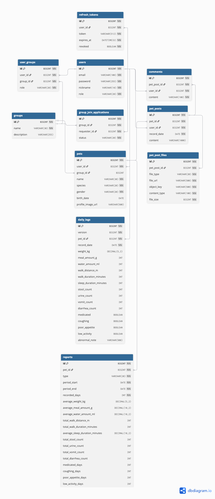
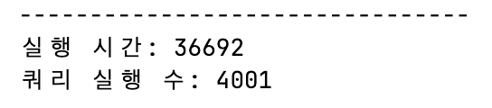
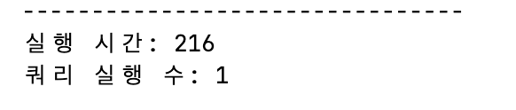
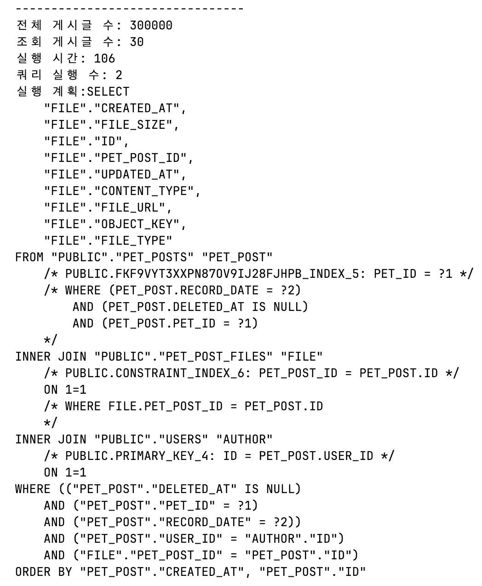

## 🐶 댕냥

<p align="center">
  
</p>

댕냥은 반려동물을 함께 키우는 사람들이 그룹을 이루어, 반려동물의 일상과 건강 상태를 기록하고 공유하는 서비스입니다

## 주요 기능

🐶 **혼자 하는 반려동물 기록이 아니라, 함께 하는 서비스**

1️⃣ **그룹 기반 반려동물 공동 관리**

`OWNER/MEMBER` 역할과 그룹 가입 신청·승인 흐름을 통해 그룹 단위 케어 및 일상 기록 시나리오를 제공합니다

2️⃣ **날짜별 게시글 업로드**

반려동물별 사진 또는 동영상을 날짜 기준으로 기록합니다

3️⃣ **`DailyLog` 기반 반려동물 데이터 관리**  

체중, 식사량, 음수량, 산책 거리와 시간, 수면 시간, 배변·배뇨 횟수, 구토·설사 횟수, 투약 여부 등 일일 건강 지표를 기록합니다

4️⃣ **주간·월간 건강 리포트 자동 생성**

누적된 `DailyLog` 데이터를 기반으로 평균 체중, 평균 식사량, 총 산책 거리, 이상 증상 발생 일수 등을 집계하고, 스케줄러를 통해 주간·월간 리포트를 자동 생성합니다

5️⃣ **주간·월간 건강 리포트 자동 생성**  
누적된 DailyLog 데이터를 기반으로 평균 체중, 평균 식사량, 총 산책 거리, 이상 증상 발생 일수 등을 집계합니다. 스케줄러를 통해 주간·월간 리포트를 자동 생성하고, 통계 쿼리와 배치 insert로 대량 리포트 생성 성능을 개선했습니다.

## 기술 스택

기술 선택은 단순 도입이 아니라, 정합성, 조회 성능, 대량 집계 처리, 캐시 일관성 문제를 해결하기 위한 목적 중심으로 진행했습니다

| 분류 | 기술 |
| --- | --- |
| Language | Java 17 |
| Framework | Spring Boot 3.5.7 |
| ORM | Spring Data JPA |
| Database | MySQL 8.0 |
| Security | Spring Security, JWT |
| Cache | Redis |
| File Storage | AWS S3 |
| Scheduler | Spring Scheduler |
| Async | Spring Async, TransactionalEventListener |

## ERD

<p align="center">
  
</p>

## 주요 성능 개선

### 1️⃣ `Report` 통계 생성 최적화

#### ❗ 문제 확인

주간·월간 `Report`는 모든 `Pet`의 `DailyLog`를 조회해 건강지표 통계를 생성합니다

초기 구현은 `Pet`마다 `DailyLog`를 조회하고, 통계 값을 계산한 뒤 `save()`를 반복 호출하는 구조였습니다

이 방식은 `Pet` 데이터가 많아질수록 조회,`INSERT` 쿼리가 증가해 `Report` 생성 시간이 길어지는 문제가 있었습니다

<p align="center">
  
</p>

#### ✅ 해결

`DailyLog` 통계 계산을 애플리케이션이 아닌 DB 집계 쿼리로 처리하고, 리포트 저장은 `JdbcTemplate batch insert`로 변경했습니다 

이를 통해 불필요한 영속성 컨텍스트 관리와 반복 insert 비용을 줄였습니다

<p align="center">
  
</p>

### 2️⃣ 날짜별 게시글 조회 인덱스 최적화

#### ❗ 문제 확인

댕냥의 게시글은 `record_date`를 기준으로 조회합니다. 특정 `Pet`의 특정 날짜 게시글을 조회하며, 하루에 여러 개의 게시글을 등록 시간순으로 확인할 수 있습니다

초기에는 `pet_id` 인덱스만 사용되어 다른 조건들은 추가 필터링으로 처리되었고, 게시글이 많아질수록 불필요한 탐색이 많아졌습니다
- 테스트 데이터: 게시글 300000건
- 조회 조건: 특정 `pet`의 특정 날짜 게시글 30건
- 개선 전 실행 계획: FK 인덱스 기반 조회

#### ✅ 해결

날짜별 게시글 조회에 대한 실행 계획을 확인하고, 조회 조건과 정렬 조건을 고려해 복합 인덱스를 추가했습니다 

<p align="center">
  
</p>

이를 통해 조회 범위를 줄이고 실행 시간을 개선했습니다

```sql
pet_id, record_date, deleted_at, created_at, id
```

### 3️⃣ 오늘의 게시글 Redis 적용

#### ❗ 문제 확인

서비스 시나리오 상 오늘 작성된 게시글은 사용자가 반복해서 조회할 가능성이 높아 DB 조회가 많이 발생했었습니다

- 오늘의 게시글은 생성/삭제가 자주 발생할 수 있지만, 어제까지의 게시글은 변경 가능성이 낮아 인덱스 기반 조회가 더 적합하다고 판단했습니다

#### ✅ 해결

오늘의 게시글만 Redis를 적용하고, 어제까지의 게시글은 복합 인덱스로 조회하도록 분리했습니다
- 오늘의 게시글: Redis 캐시 우선 조회
- 어제까지의 게시글: DB 복합 인덱스 기반 조회

### 4️⃣ 게시글 캐시 갱신 비동기 처리

#### ❗ 문제 확인

1. 게시글 생성/삭제 시 캐시를 즉시 갱신하면 트랜잭션 안에서 Redis 작업과 DB 작업이 함께 진행돼서 캐시 동기화 비용이 요청 시간에 포함되는 문제가 있습니다

2. 트랜잭션이 커밋되기 전에 캐시가 먼저 갱신되어 커밋되지 않은 데이터가 Redis에 저장될 수 있습니다

#### ✅ 해결

게시글 생성/삭제 시 직접 Redis를 갱신하지 않고 이벤트를 발행하도록 변경했습니다
- 캐시 갱신과 삭제는 `@TransactionalEventListener(phase = AFTER_COMMIT)`으로 DB 커밋 이후 실행
- `@Async`와 별도 `cacheTaskExecutor`를 통해 요청 스레드와 분리
  - 생성/삭제 요청: 이벤트만 발행
  - 커밋 이후: 캐시 갱신/삭제
  - 캐시 동기화: 별도 스레드에서 비동기 처리

### 5️⃣ `Report` 통계 생성 스케줄러 처리

#### ❗ 문제 확인

주간·월간 `Report`는 모든 반려동물의 `DailyLog`를 통계로 생성하는 작업으로, 
API 요청 시점에 처리하면 집계 대상 데이터가 많아질수록 응답 시간이 길어져 사용자가 기다려야 하는 문제가 있습니다

또한 `Report`는 실시간 생성보다 정해진 주기마다 생성해도 충분한 데이터이므로, 요청과 분리된 배치성 작업으로 처리하는 것이 적합하다고 판단했습니다

#### ✅ 해결

`Spring Scheduler`를 사용해 주간·월간 `Report`를 정해진 시점에 자동 생성하도록 처리했습니다

```java
@Scheduled(cron = "0 0 0 * * MON")
public void generateWeeklyReports() {
    reportService.generateWeeklyReports(LocalDate.now());
}

@Scheduled(cron = "0 0 1 1 * *")
public void generateMonthlyReports() {
    reportService.generateMonthlyReports(LocalDate.now());
}
```
사용자는 이미 생성된 리포트를 조회하기만 하면 되므로, 무거운 통계 집계 작업을 사용자 요청 흐름에서 분리할 수 있었습니다
